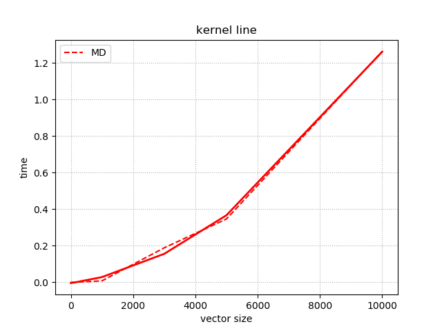

# PMPP Compositional GPU

## 1. GPU Function
We add 5 GPU kernel
1. nop-kernel, which do nothing. after being called, it will return.
2. min-kernel, which return the smallest element of a vector.
3. max-kernel, which return the biggest element of a vector.
4. scalarProduct-kernel, which return the scalar product of 2 vectors, or 2 same vectors.
5. matrix_double_kernel, which multiplies all elements in the matrix by 2.

## 2. Time for Single Funtion

By measuring we obtain the running time of all functions under different input sizes.

|flag|function|time (of vector with 1 element/100 elements/10000 elements/65536 elements)|
|---|---|---|
|NK|nop-kernel | 6.06e-07 sec|
|MIK|min-kernel| 4.214e-04 sec /4.342e-04 sec/4.548e-04 sec/6.180e-04|
|MAK|max-kernel| 4.193e-04 sec /4.410e-04 sec/ 4.543e-04 sec/ 5.930e-04 sec|
|SPK|scalarProduct-kernel| 4.56e-04 sec/4.553e-04/4.905e-04 sec/4.944e-04 sec|
|MD|matrix_double_kernel |4.494e-04 sec/5.459e-04/8.197e-03 sec(1000)/0.189(3000)/0.347(5000)/1.264 sec(10000) |
|N|Nopper |1.774e-06 sec|
|I|Increaser|2.227e-06 sec/2.148e-06 sec/3.131e-06 sec/1.796e-05 sec|
|QS|QuickSorter|2.059e-06 sec/1.621e-06 sec/7.840e-05 sec/6.223e-04 sec|
|RA|ReduceAddVector|2.548e-06 sec/3.679e-06/1.849e-05/1.117e-04|
|RM|ReduceMin|2.031e-06 sec|
|RO|Reorderer|1.753e-06 sec/3.662e-06sec/7.88e-05 sec/4.788e-04 sec|
|SS|SelectionSorter|2.121e-06 sec/3.419e-06 sec/4.509e-03 sec/0.205 sec|

It seems the time of function F with input size V is not equal to size(V)*time(F) in our experiments.
The reason might be that the functions are all parallel but the vector size is not enough big.

So we choose bigger vector size for GPU kernel:

|flag|function|time/s (of vector with 10000 element/100000 elements/1000000 elements/3000000 elements/5000000 elements/)|
|---|---|---|
|MIK|min-kernel|4.548e-04/6.294e-04/3.662e-03/8.365e-03/0.0161|
|MAK|max-kernel|4.543e-04/7.083e-04/2.859e-03/9.994e-03/0.0114|
|SPK|scalarProduct-kernel|4.905e-04/1.386e-03/9.247e-03/0.0337/0.0498|


We can observe that each function has a base time of similar duration, which we guess is used for the loading of the task.

As the new result we get, min kernel, max kernel and scalar product kernel have linear growth with size of vector, 


And matrix double kernel has super-linear growth with size of vector.


According to the data, we use least squares to get the estimation function of vector size x:


|Flag|Function|function(s)|
|---|---|---|
|MIK|min-kernel|1.0473e-08 * x^2 + 2.1779e-05 * x - 0.0034685|
|MAK|max-kernel|3.0286e-09 * x + 0.00036195|
|SPK|scalarProduct-kernel|2.4106e-09 * x + 0.00058695|
|MD|matrix_double_kernel|1.01828e-08 * x + 0.00032437|

The fitting curves are as following:




## 3. Time for Compositional GPU
We measure the running time of different combinations, including, the combination of GPU and GPU functions, the combination of GPU and CPU functions.

Composition Test:

|function_A&function_B|size(vec_A)|size(vec_B)|time(A)/s|time(B)/s|time/s|
|---|---|---|---|---|---|
|MAK+NK|10000|1|4.543e-04|6.06e-07 |4.640e-04|
|SPK+NK|100|1|4.553e-04|6.06e-07|4.702e-04|
|MIK + NK|10000|1|4.548e-04 |6.06e-07|4.633e-04|
|N + NK|1|1|1.774e-06|6.06e-07|3.885e-06|
|I + MIK|10000|10000|3.131e-06|4.548e-04 sec|4.745e-04|
|QS+MAK|100|100|1.621e-06|4.410e-04|4.590e-04|
|SS+MAK|100|100|3.419e-06|4.410e-04|4.395e-04|
|RO + SPK|100|100|3.662e-06|4.553e-04|4.5046e-04|
|RM+NK|1|1|2.031e-06|6.06e-07|9.392e-06|
|SS+SPK|10000|10000|4.509e-03|4.944e-04|4.700e-03|

Relative Error = (test_time - (timeA+timeB))/(timeA+timeB) * 100%

|FunA & FunB|timeA+timeB/s|test_time/s|Relative error|
|---|---|---|---|
|MAK+NK|4.549e-04|4.640e.04|2%|
|SPK+NK|4.559e-04|4.702e-04|3.1%|
|MIK + NK|4.554e-04|4.633e-04|1.7%|
|N + NK|2.38e-06|3.885e-06|63.2%|
|I + MIK|4.579e-04|4.745e-04|3.6%|
|QS+MAK|4.426e-04|4.590e-04|3.7%|
|SS+MAK|4.444e-04|4.395e-04|-1.1%|
|RO + SPK|4.589e-04|4.5046e-04|-1.8%|
|SS+SPK|5.003e-03|4.700e-03|-6%|

**Conclusion:**
1. Except for N+NK, the relative errors of the experimental results of all other groups are less than 10%, and it can be considered that the method of estimating the function combination by the sum of each single function is feasible.

2. We find that the relative error is positive for all GPU-to-GPU combinations,We think there may be other factors to consider in the GPU-to-GPU combination.

3. We observe that the relative error is positive for all experiments including the nop-kernel. Especially in the N+NK experiment, the error is as high as 63.2%.I think it can be deduced that there is still something not taken into account in the modeling with nop-kernel.


Prediction of unused size with model:

|function(s)|size(vec_A)|size(vec_B)|time/s|model_time/s|Relative error|
|---|---|---|---|---|---|
|MAK+NK|60000|1|6.532e-04|7.322e-04|-10.78%|
|SPK+NK|200000|1|2.278e-03|2.236e-03|1.87%|
|MIK|8000000| - |0.0238564|0.0245906|-3.0%|
|MD|1500|- |0.0128734|0.05286|-75%|

**Conclusion:**

1. We can see that for linear functions, the model obtained by combining the modeling methods is more accurate, but for superlinear functions, this accuracy may depend on the chosen fitting method.
2. Through experiments on a single GPU function and a combination of two GPU functions, we preliminarily verify the feasibility of combining performance modeling in GPU programming.


## 5. Problem found in experiments
### GPU initialization

When we execute following code,we get following result\
code:
```python
        timer1(tp_nop);
        timer1(tp_nop);
```
result:
```
Testing Time of : taskpool(1,Nop_GPU)
repeats: 1000
size: 1
average time of taskpool(1,Nop_GPU) is 0.000282549 sec

Testing Time of : taskpool(1,Nop_GPU)
repeats: 1000
size: 1
average time of taskpool(1,Nop_GPU) is 6.06e-07 sec
```

I guess the first timer always includes the time that initialization of GPU using.
